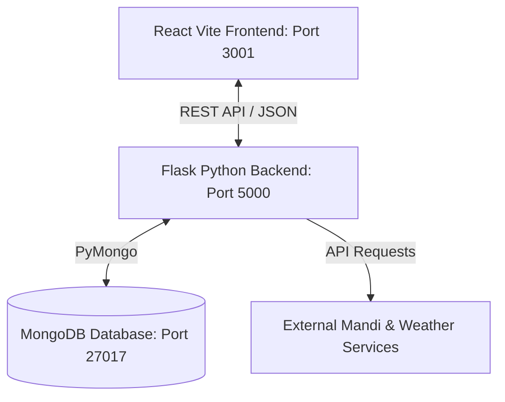

# AI-Driven Crop Detection & UI Component Library

A high-performance, full-stack application built for smart agricultural management and UI component curation. Features include AI crop detection, live weather integration, mandi price analysis, a verified crop database, secure JWT authentication, and a dynamic dashboard.

---

## 🏗️ System Architecture

The application is structured into three main layers:



*   **Frontend**: React 18, TypeScript, Vite, Tailwind CSS, Radix UI.
*   **Backend**: Flask (Python 3.8+), JWT Authentication, PyMongo.
*   **Database**: MongoDB (NoSQL) for highly flexible crop metadata and UI component schemas.

---

## ⚡ Quick Start: Docker Compose (Recommended)

If you have Docker and Docker Compose installed, you can spin up the entire stack (Database, Backend, Frontend, and Nginx reverse proxy) in a single command.

1. Navigate to the `docker` directory:
   ```bash
   cd docker
   ```
2. Start the services:
   ```bash
   docker-compose up --build -d
   ```
3. The application will be accessible at:
   - Frontend: [http://localhost:3000](http://localhost:3000)
   - Backend API: [http://localhost:5000](http://localhost:5000)

---

## 🛠️ Step-by-Step Manual Running Guide (Windows)

Follow these instructions to run the application locally on Windows.

### Prerequisites
Make sure you have the following installed:
*   [Python 3.8 or higher](https://www.python.org/downloads/)
*   [Node.js 16 or higher](https://nodejs.org/)
*   [MongoDB Community Server](https://www.mongodb.com/try/download/community)

---

### Step 1: Start MongoDB
1. Ensure the MongoDB service is running. 
   - Open **Services** (`services.msc`), find **MongoDB Server (MongoDB)**, and click **Start**.
   - *Alternatively, run in PowerShell/Command Prompt:*
     ```powershell
     mongod --dbpath "C:\data\db"
     ```
     *(Make sure the path `C:\data\db` exists on your system)*

---

### Step 2: Configure & Start Backend
Open a terminal in `AI Driven Crop\Backend`:

1. **Create and Activate Python Virtual Environment:**
   *   **PowerShell:**
       ```powershell
       python -m venv venv
       .\venv\Scripts\Activate.ps1
       ```
   *   **Command Prompt (CMD):**
       ```cmd
       python -m venv venv
       .\venv\Scripts\activate.bat
       ```

2. **Install Dependencies:**
   ```bash
   pip install -r requirements.txt
   ```

3. **Configure Environment Variables:**
   *   Copy `.env.example` to `.env`:
       ```cmd
       copy .env.example .env
       ```
   *   *(Optional)* Open `.env` and verify the values:
       - `MONGO_URI=mongodb://localhost:27017/complete_ui_prompts`
       - `CORS_ORIGINS=http://localhost:3000,http://127.0.0.1:3000,http://localhost:3001` (Make sure your frontend ports are allowed)

4. **Seed the Crop Database:**
   Seed MongoDB with default verified crop records (Tomato, Rice, Wheat, Potato, etc.):
   ```bash
   python seed_crops.py
   ```

5. **Start Flask Server:**
   ```bash
   python run.py
   ```
   The backend API will run at [http://localhost:5000](http://localhost:5000). You can check its health by opening [http://localhost:5000/api/health](http://localhost:5000/api/health).

---

### Step 3: Configure & Start Frontend
Open a new terminal window in `AI Driven Crop\Frontend`:

1. **Install Dependencies:**
   ```bash
   npm install
   ```

2. **Verify Local Environment:**
   Ensure the `.env.local` file contains:
   ```env
   VITE_API_URL=http://localhost:5000/api
   VITE_APP_NAME="AI Driven Crop Detection"
   ```

3. **Start Frontend Dev Server:**
   ```bash
   npm run dev
   ```
   The frontend will start on [http://localhost:3001](http://localhost:3001) (or another port if 3001 is in use). Open this URL in your web browser.

---

## 🔍 Health & Verification Checks

| Service | Address | Expected Health Check Output |
| :--- | :--- | :--- |
| **MongoDB** | `localhost:27017` | Standard connection message or success in terminal |
| **Backend API** | `http://localhost:5000/api/health` | `{"database":"Connected","message":"...","status":"healthy"}` |
| **Frontend UI** | `http://localhost:3001` | Stunning React UI login/dashboard page |

---

## 🛠️ Troubleshooting

*   **MongoDB Connection Error**: If you see `ServerSelectionTimeoutError` in the backend terminal, make sure MongoDB is running locally on port `27017`.
*   **CORS Blocked**: If requests from the frontend fail, check the backend `.env` file and make sure the `CORS_ORIGINS` include the exact port of your frontend (e.g., `http://localhost:3001` or `http://localhost:3000`).
*   **ModuleNotInstalledError (Python)**: Make sure you activated your virtual environment (`venv`) before running `pip install` and starting `run.py`.
